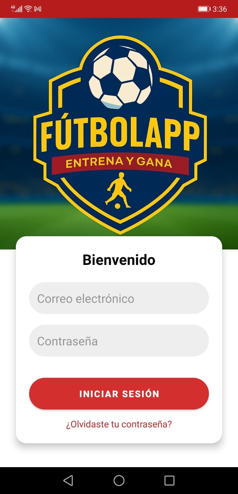
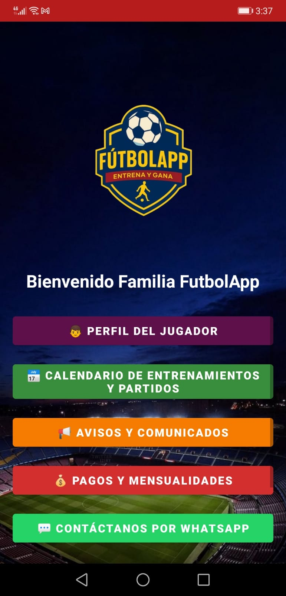
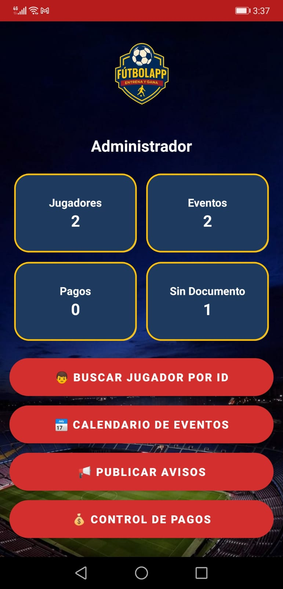
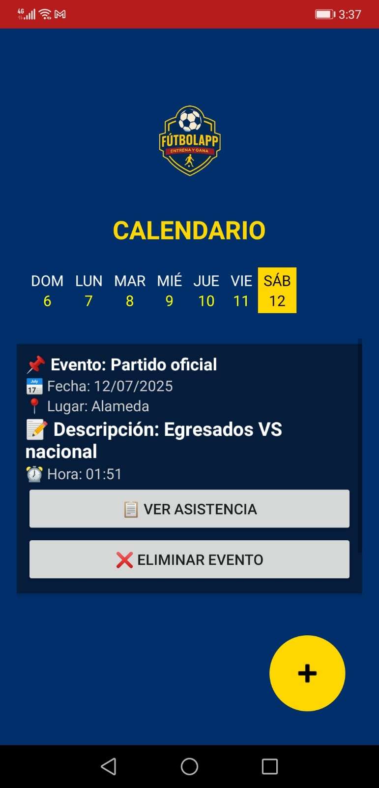
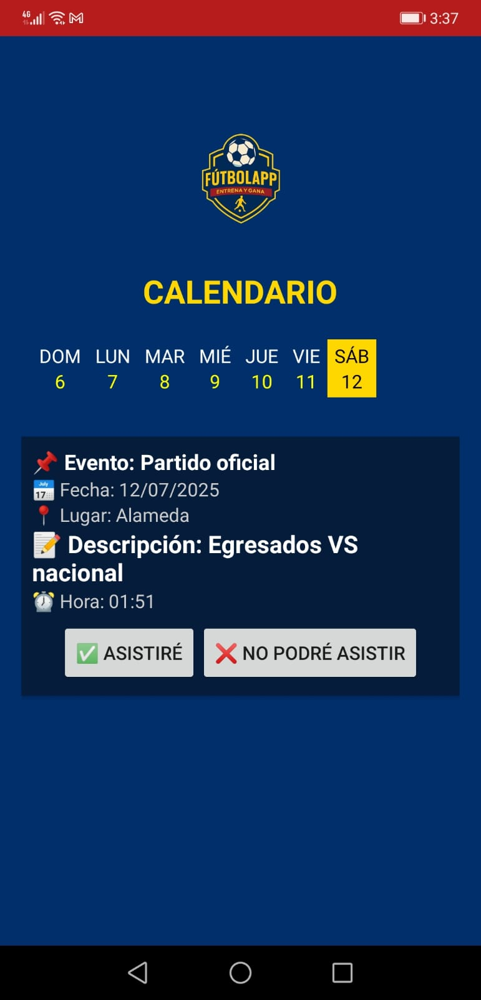
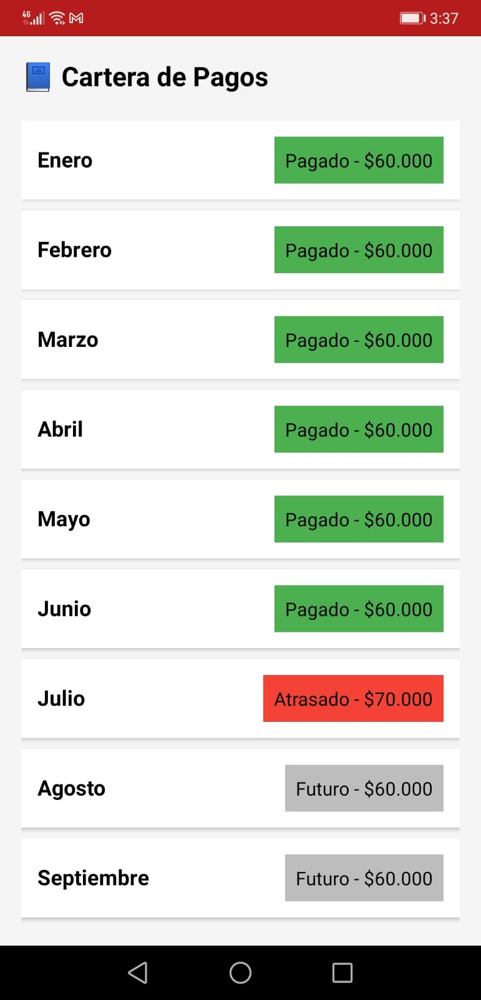

# FútbolAPP ⚽📱

**FútbolAPP** es una aplicación móvil desarrollada en Android que permite a escuelas de fútbol gestionar de forma digital e intuitiva la información de jugadores, entrenamientos, eventos, pagos, y más. Desarrollada con Firebase como backend, esta herramienta está diseñada tanto para **padres/acudientes** como para **administradores**.

---

## 🛠️ Funcionalidades principales

- 🔐 **Inicio de sesión por roles**: para acudientes y administradores.
- 🧑‍🎓 **Gestión de perfiles de jugadores**: con foto, categoría, EPS, y documentos.
- 📆 **Calendario de eventos**: partidos, entrenamientos, y otros eventos.
- ✅ **Confirmación de asistencia**: los acudientes pueden responder si asistirán o no.
- 💸 **Gestión de pagos y mensualidades**: con control de pagos atrasados.
- 📣 **Avisos y comunicados importantes**: para mantener informados a los usuarios.
- 📤 **Carga y visualización de documentos**.
- 🔍 **Búsqueda avanzada por ID de jugador (admin)**.

---

## 🖼️ Capturas de pantalla

### 🔐 Pantalla de Login
> Inicio de sesión con autenticación por rol: acudiente o administrador.

---

### 🧑‍💼 Panel del Usuario (Acudiente)
> Interfaz amigable donde el padre o acudiente puede ver el perfil de su hijo, consultar eventos, recibir avisos, gestionar pagos y más.

---

### 🧑‍💻 Panel del Administrador
> Herramientas para gestionar jugadores, eventos, pagos, avisos y ver asistencia a eventos.

---

### 🗓️ Crear Evento (Administrador)
> Permite registrar un nuevo partido o entrenamiento con fecha, hora, lugar y descripción. Incluye botón para ver la asistencia o eliminar el evento.

---

### 👀 Vista de Evento para el Usuario
> Muestra detalles del evento y permite confirmar asistencia.

---

### 💳 Gestión de Pagos
> Visualiza el estado de las mensualidades. Si hay pagos atrasados, se recalcula el valor automáticamente.

---

## 🚀 Tecnologías utilizadas

- Java (Android)
- Firebase Authentication
- Firebase Firestore
- Firebase Storage
- Firebase Cloud Messaging (FCM)
- Material Design UI

---

## 🔧 Cómo ejecutar la app

1. Abre el proyecto con **Android Studio**.
2. Coloca tu archivo `firebase-key.json` en:
